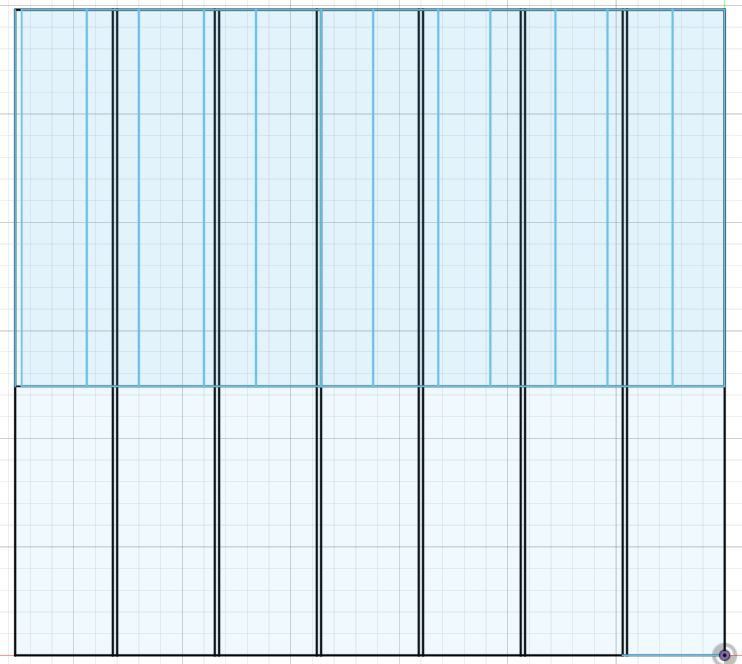
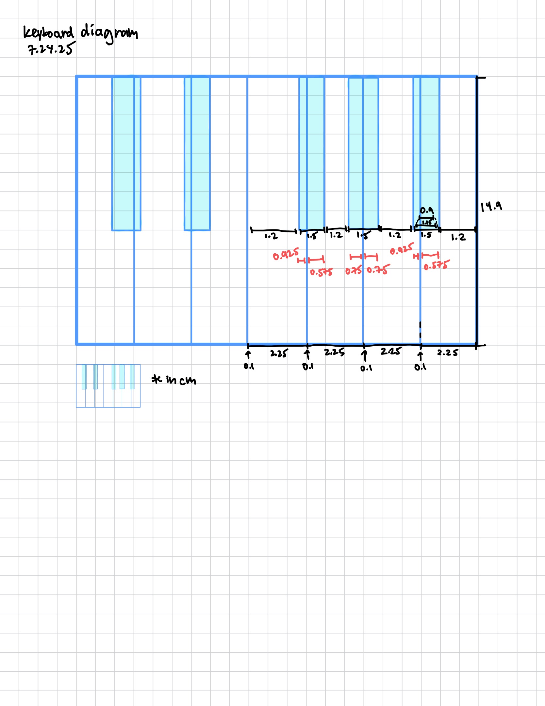

# 4 // July 25
### hrs: 1

Made a sketch on Fusion for 1/4 of the keyboard with previous measurements, but the top part for the black keys doesn’t match up with the whole setup I have. It’s short by 16.35 - 15.9 = 0.45cm.

0.45 divided by 5 black keys is a nice number, 0.9. I’m going to add 0.9cm to each black key and redraw my design. Wait, nevermind. Tried it on rapidtables and it looked way too big. Time to find an alternative.

# 3 // July 24
### hrs: 2

Okay I was encountering hella errors but I finally got it to work (9:26am)!!

Yippee! Anyways I’m gonna start designing.

I made an initial design, but making a sketch w/o a diagram sucks. I’ll make one during lunch.

So it’s 9:45. Made a sketch…

10:44pm, just opened Fusion. I'm gonna try to design the basic parts of the keys. I'll figure out electronics tomorrow 'cause I'm lazy.

# 2 // July 20
### hrs: 1

Found a Yamaha Clavinova with a friend and measured it together :)

# 1 // July 19 - initial ideas

I want to make a portable piano keyboard. I opened Fusion 360 and yeah I’m looking for stuff, like the measurements for the keys. I can’t find this certain length…I dunno. I made the sketch for a white key so far though.